<div align="center">

<picture>
  <source media="(prefers-color-scheme: dark)" srcset="./dark.svg">
  <source media="(prefers-color-scheme: light)" srcset="./light.svg">
  
</picture>

</div>

<br>

## Hi, I'm Suresh K

I'm a Python Backend Developer working with Django, Django REST Framework, PostgreSQL and production backend systems.

I build workforce-management features, APIs, database-driven systems, geofencing workflows and computer-vision pipelines.

My current work at **Datamoo.ai** focuses on **FaceViz**, a production workforce management platform used across 20+ client organizations.

<br>

## Engineering Focus

| | Area | What it involves |
|---|---|---|
| 01 | **Backend APIs** | Designing and building REST APIs with Django and Django REST Framework |
| 02 | **Workforce Systems** | Attendance, tasks, timesheets, tickets, leave and expense modules |
| 03 | **Geofencing & Location** | Site-based location validation and live punch-location tracking |
| 04 | **Payroll & Attendance** | Salary configuration, earnings/deductions, payslip generation |
| 05 | **Computer Vision Pipelines** | CCTV face-recognition attendance pipeline built on InsightFace and SCRFD |

<br>

## FaceViz — Workforce Management & Employee Operations Platform

A production platform used across **20+ client organizations**. I work on backend modules covering:

**Attendance** · **Location / Geofencing** · **Payroll** · **Tasks** · **Timesheets** · **Tickets** · **Leave** · **Expenses**

**Smart Attendance**
- Face-verified punch in/out
- Location validation with geofence-exception flagging
- Working-hours calculation
- Missed-punch tracking and regularization workflows

**Location & Geofencing**
- Admin-defined work / client sites
- Live punch-location tracking
- Trip / travel-route monitoring
- Field-team location workflows

**Payroll Engine**
- Salary configuration, earnings and deductions
- Work codes and payroll processing
- Payslip generation
- Attendance and leave data as calculation inputs

<br>

## CCTV Face Recognition Pipeline

A CCTV-based face-recognition attendance pipeline designed for resource-constrained servers, tuned for **4 vCPU / 8GB RAM**.

```
RTSP CAMERA → CAPTURE → SCRFD → TRACK / DEDUP → ENHANCE → S3 / API
```

Capture → Detection / Tracking → Face Quality Checks → Deduplication → Cropping / Enhancement → Async Upload

**Built with:** InsightFace · SCRFD · ONNX Runtime · OpenCV · RTSP/CCTV · DigitalOcean Spaces

<br>

## Technical Stack

**Backend**
`Python` `Django` `Django REST Framework` `Flask` `REST API Design` `JWT Authentication` `Role-Based Access Control`

**Database**
`PostgreSQL` `MySQL` `SQLite`

**Computer Vision**
`OpenCV` `InsightFace` `SCRFD` `ONNX Runtime` `Face Detection` `Face Tracking` `Image Enhancement` `RTSP/CCTV`

**Frontend**
`React.js` `TypeScript` `Vite` `Tailwind CSS` `Bootstrap`

**Infrastructure / Tooling**
`DigitalOcean Spaces` `S3` `Git` `GitHub` `Postman` `Bruno` `Cron Jobs` `Streamlit`

<br>

## Featured Projects

**[CartGenius](https://luxcard.vercel.app)**
Full-stack e-commerce application built with React (Vite) and Django, featuring JWT authentication and cart management.
`React.js` `Django` `MySQL` `FakeStoreAPI`

**[Translator Pro](https://translatorpro.onrender.com)**
Web translation application with a Flask backend and MongoDB supporting multi-language text translation.
`Flask` `MongoDB`

<br>

## Professional Experience

**Python Backend Developer** — Datamoo.ai
*Oct 2025 – Present*

Product: FaceViz — Workforce Management & Employee Operations Platform

- Built backend modules using Django and Django REST Framework
- Worked with PostgreSQL-backed production systems
- Contributed to attendance, location/geofencing, payroll, tasks, timesheets, tickets, leave and expense modules
- Worked on production reliability and backend API development
- Designed and built a CCTV face-recognition attendance pipeline

<br>

## Education

**Bachelor of Computer Applications (BCA)**
Agurchand Manmull Jain College, Chennai, Tamil Nadu
Aug 2021 – Jun 2024 · CGPA: 8.05/10

**Full Stack Python**
Besant Technologies
*Relevant training: Python · SQL · HTML · CSS · Bootstrap · JavaScript · React.js*

<br>

## Connect

[](mailto:sureshksureshk04@gmail.com)
[](https://linkedin.com/in/suresh-pythondev)
[](https://github.com/SureshK2004)
